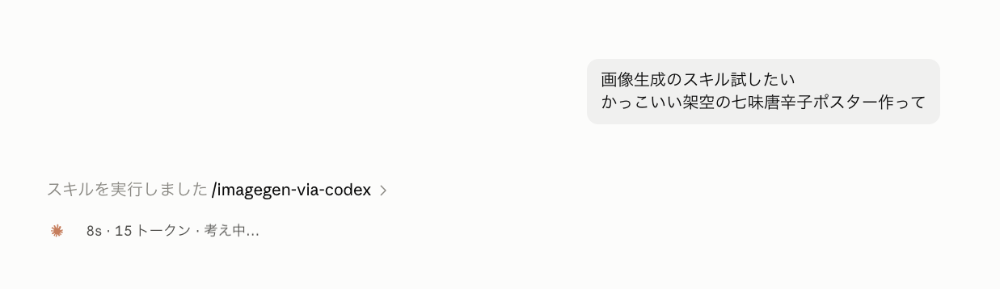
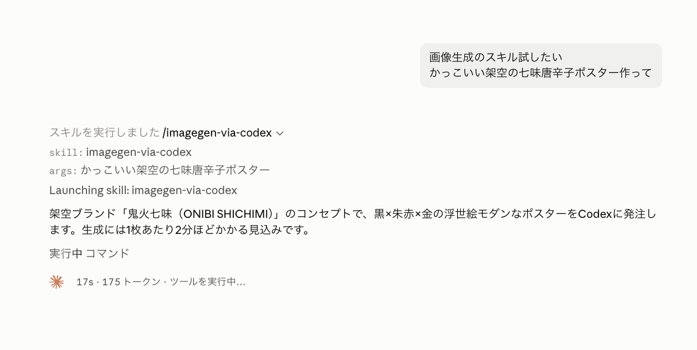
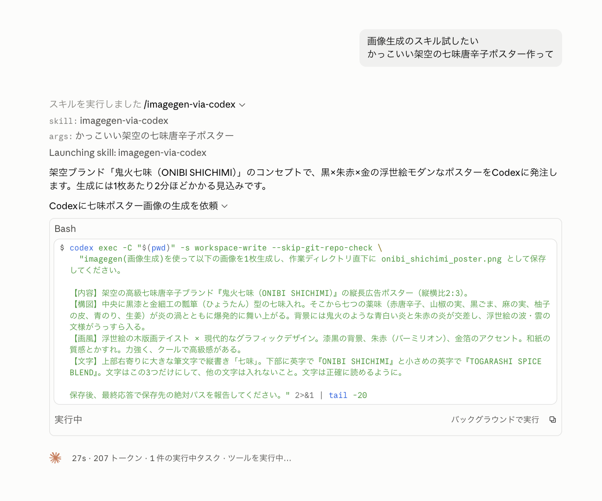
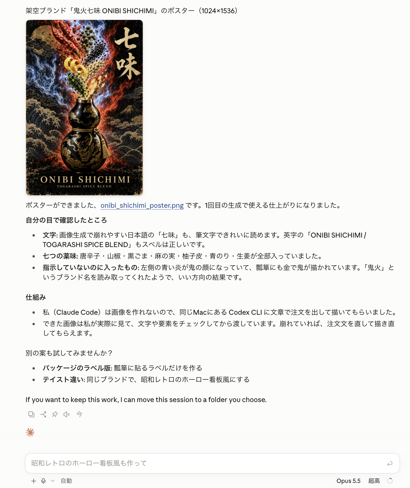
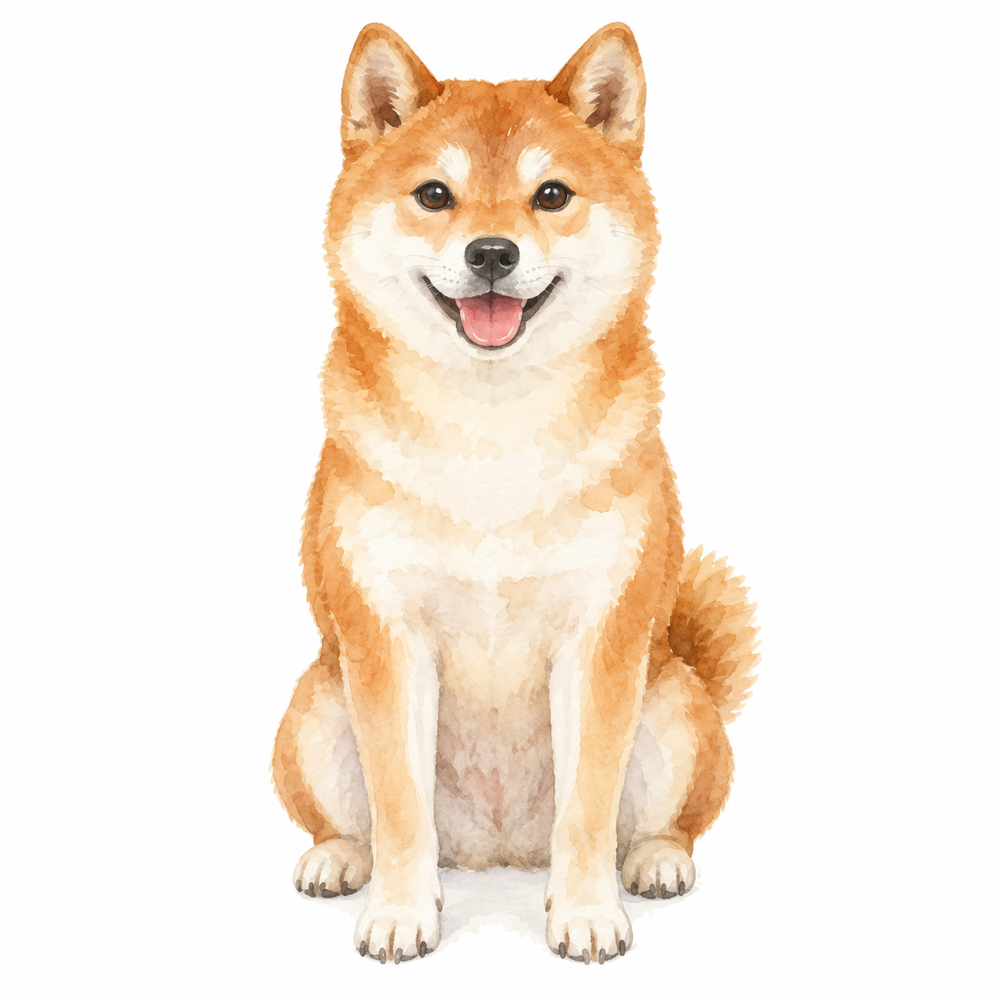

# imagegen-via-codex

Claude CodeからCodex CLIに画像生成を依頼し、できた画像をClaudeが確認するためのスキルです。

Claude Codeで作業しているときに、イラストやサムネイルもそのまま頼めるように作りました。Claudeが画像の内容を整理してCodexに依頼し、保存された画像を開いて確認します。指示と違うところがあれば、修正を依頼します。

本体は [SKILL.md](SKILL.md) 1枚です。独自のサーバーやAPIキー管理機能はありません。

## 使用例：架空の七味唐辛子ポスター

作者が実際に使ったときの画面です。次の短い依頼から、Claudeが画像の構図や配色、入れる文字を考えてCodexに生成を依頼しています。

> 画像生成のスキル試したい
> かっこいい架空の七味唐辛子ポスター作って

### 依頼すると、Claudeがスキルを使う

スキル名を指定せずに頼んだ例です。Claudeが `imagegen-via-codex` を選んでいます。



<details>
<summary>Claudeが考えた内容と、Codexへの生成依頼を見る</summary>

Claudeが架空ブランド「鬼火七味（ONIBI SHICHIMI）」を考え、黒・朱・金を使った浮世絵風のポスターとして内容を具体化しています。



構図、七つの薬味、背景、文字などをプロンプトにまとめ、`codex exec` で画像生成を依頼しています。



画面は作者の利用時のものです。最新の実行手順は [SKILL.md](SKILL.md) を参照してください。

</details>

### 生成した画像と、Claudeの確認結果が返ってくる

完成したポスターとともに、文字や薬味の描写についてのClaudeの確認結果が表示されています。



## 使うために必要なもの

- ローカルのコマンド実行と画像の読み取りができるClaude Code
- 同じ実行環境にインストールされ、ログイン済みのCodex CLI
- Codexの内蔵画像生成ツールを利用できる環境・アカウント
- インターネット接続と、画像を保存できるフォルダ

**Codexにログインできることと、画像生成ツールを使えることは別です。** 利用できる機能は、アカウント、設定、バージョンなどによって変わります。このスキルを入れるだけで、どの環境でも画像生成が使えるようになるわけではありません。

macOSで使っていたスキルを公開しています。Windows・Linuxでの動作は未確認です。以下のコマンド例はmacOSなどのBash・zsh向けです。

## インストールする

まず、Claude Codeから使うターミナルで次のコマンドを実行します。

```bash
codex --version
codex login status
```

`codex` が見つからない場合は、[Codex CLIの公式案内](https://developers.openai.com/codex/cli/)に沿ってインストールしてください。未ログインの場合は `codex login` を実行します。ログイン方法は[公式ドキュメント](https://developers.openai.com/codex/auth/)で確認できます。

次に、このリポジトリをClaude Codeの個人用スキルフォルダに置きます。Gitが必要です。

```bash
mkdir -p "$HOME/.claude/skills"
git clone https://github.com/mocchicc/imagegen-via-codex.git \
  "$HOME/.claude/skills/imagegen-via-codex"
```

すでに同名のフォルダがある場合は、このコマンドは失敗します。以前のスキルを削除せず、内容を確認してからバックアップや統合をしてください。

Gitを使わない場合は、[SKILL.md](SKILL.md)をダウンロードし、`~/.claude/skills/imagegen-via-codex/SKILL.md` に保存しても使えます。スキルの配置方法は[Claude Codeの公式ドキュメント](https://code.claude.com/docs/en/skills)でも確認できます。

## Claude Codeで画像を頼む

Claude Codeで、次のように依頼します。

```text
/imagegen-via-codex
白い背景に、正面を向いて座る柴犬1匹の水彩イラストを作って。
文字、ロゴ、透かしは入れないで。正方形で、images/shiba-watercolor.png に保存して。
```

スキル名を指定せず「画像を生成して」と頼んだ場合も、Claudeが内容に応じてこのスキルを選びます。選ばれないときは、上のように名前を指定してください。

修正したいときは、対象のファイルと変更点を伝えます。

```text
images/shiba-watercolor.png の柴犬はそのままで、背景だけ淡い青にして。
元のファイルは残して、images/shiba-watercolor-v2.png に保存して。
```

Claudeは、Codexに生成を依頼したあと、保存された画像を開いて確認します。結果はファイルとして保存されます。会話の中に画像を表示できるかどうかは、使っているアプリによって異なります。

上の例と同じ内容をCodex CLIに依頼して生成した画像です。



## 使う前に知っておいてほしいこと

### ClaudeとCodex、両方の利用枠を使います

Claudeでのやり取りに加えて、Codex側でも処理が走ります。修正を繰り返すと、その分の利用量も増えます。スキル自体は無料ですが、各サービスの利用が無料になるわけではありません。

このスキルはCodexの内蔵画像生成ツールを使う前提です。画像生成API用のキーを別途登録する手順は含みません。料金や利用上限は、ご自身の契約と各サービスの最新の案内を確認してください。画像生成が使えない場合に、別のAPI課金へ自動で切り替えることはしません。

### 依頼文と参照画像は外部サービスで処理されます

ローカルでコマンドを実行しますが、画像生成までパソコン内だけで完結する仕組みではありません。生成の依頼文や参照画像はOpenAI側で処理され、Claudeが画像を確認する際にも、Claudeの利用環境に応じて処理されます。顧客情報、個人情報、未公開資料などは、所属先のルールと各サービスの設定を確認してから扱ってください。

Codexは手元の設定と権限で起動します。`workspace-write` は書き込みを制限する設定であり、作業フォルダ外のファイルを一切読めなくする保証ではありません。共有できないファイルがある環境では、作業場所と設定を確認してください。

### 生成には数分かかることがあります

スキルでは、コマンドの待ち時間を10分にするよう案内しています。必ず10分以内に終わるという意味ではありません。

待ち時間を超えても、処理が続いている場合があります。同じ画像を重複して生成しないよう、再実行する前に処理の状態と保存先を確認します。

### 画像は最後に自分でも確認してください

Claudeも画像を確認しますが、文字の誤りや不自然な描写をすべて見つけられるとは限りません。特に日本語の文字、要素の数、細部の形は、使用前に見直してください。図解に含まれる数値や説明の正しさも、画像の見た目とは別に確認が必要です。

### 保存先と上書きに注意してください

保存先とファイル名を指定すると、生成後に探しやすくなります。指定がない場合は、Claudeが作業中のプロジェクト内に保存先を用意します。修正版は原則として別名で保存します。Codex側の保存領域にも元の生成画像が残ることがあるため、共有端末ではその扱いも確認してください。

## うまく動かないとき

| 状況 | 確認すること |
| --- | --- |
| スキルが見つからない | `~/.claude/skills/imagegen-via-codex/SKILL.md` があるか確認し、Claude Codeで新しいセッションを開きます。 |
| `codex: command not found` と出る | Claude Codeが使う実行環境から、`codex --version` が通るか確認します。 |
| ログインエラーが出る | `codex login status` を確認し、必要なら自分で `codex login` を実行します。認証情報をチャットやIssueに貼らないでください。 |
| 画像生成ツールを使えないと言われる | Codex単体で同じ画像を生成できるか確認します。CLIのバージョンや設定、アカウントによって利用できない場合があります。 |
| 保存できない | 保存先フォルダの存在と書き込み権限を確認します。保護を一括解除するオプションは、このスキルの手順に含めていません。 |
| 時間切れになった | 元の処理が終わっているか、画像が保存されていないかを確認してから再実行します。 |
| 警告やエラーらしい表示が出た | 表示だけで判断せず、処理の終了状態と今回の出力画像を確認します。 |

解決しない場合は、[Issues](https://github.com/mocchicc/imagegen-via-codex/issues)にOS、Claude CodeとCodex CLIのバージョン、起きたことを記載してください。ログを貼る場合は、認証情報や個人のパス、依頼に含まれる非公開情報を取り除いてください。

## 動作確認について

元のスキルには、2026年8月10日にmacOS・Codex CLI 0.144.1で、柴犬の水彩画像を生成し、Claude側で読み取るところまで確認した記録があります。

2026年9月26日には、macOS・Codex CLI 0.157.1・ChatGPTログインの環境で、公開版と同じ `codex exec` の呼び出し方を確認しました。内蔵画像生成ツールでPNG画像を1枚生成し、指定先への保存と画像の表示・内容を確認しています。使い方の節に掲載した柴犬の画像が、そのときの出力です（1254 × 1254ピクセル）。

この動作確認はCodex CLIからの新規生成と保存までです。冒頭のポスターの画面は、それとは別に作者がClaudeからスキルを使った際の記録です。公開版をClaude Codeから呼び出す一連の操作、既存画像の編集、Windows・Linuxでの動作は再検証していません。

## ライセンスとこのスキルの位置づけ

[MIT License](LICENSE)で公開しています。スキルのコピー、変更、再配布ができます。再配布するときは、ライセンスと著作権の表示を残してください。

このライセンスはリポジトリ内のスキルと文書に適用されます。ClaudeやCodexなどのサービスの利用条件、生成した画像の扱いは、各サービスの条件も確認してください。

個人が作成した非公式のスキルです。AnthropicやOpenAIの公式提供・推奨を示すものではありません。
